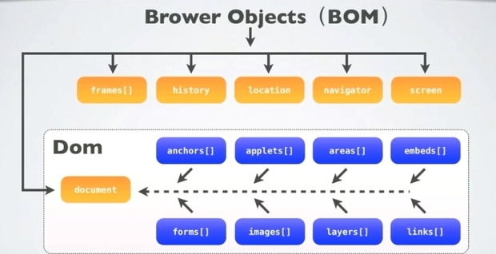

### 一、HTML

#### 1、对 HTML 语义化的理解?

1 增加文档可读性，利于维护。 2. 便于搜索引擎爬虫爬取更多网站关键信息，利于 SEO。 3. 在没有 CSS 样式时，页面能呈现出好的内容结构，增强阅读性。 4. 方便盲人阅读器等设备解析，根据语义渲染网页。

#### 2、什么是 viewport？

> viewport：是网页可视区域，在 移动 web 开发中使用，表示将设备浏览器高度虚拟成一个特定的值，利于移动 web 站点跨设备显示效果的一致性。

1. width ：页面宽度。
2. height ：设置 layout viewport 高度。
3. divice-width ：设备物理宽度。
4. initial-scale ：设置页面初始缩放值。
5. maximum-scale / minimum-scale ：允许用户最大/小大缩放值。
6. user-scalable ：使用 yes / no 控制用户能否对页面进行缩放。

#### 3、img 中 alt 和 title 的作用？

- alt ：若图片无法显示，浏览器会显示 alt 中内容。
- title ：鼠标移动到元素上时，显示 title 中内容。

#### 4、href 与 src 区别？

- herf ：是 Hypertext Reference，超文本引用，指定超链接的 URL，加载过程中，不会暂停其他资源的行为或下载。
- src ：是 Sourse，指向需要下载的资源，会暂停其他资源的下载，直到当前资源加载、编译、执行完成。

#### 5、doctype 作用？

> doctype :通用标记语言的文档类型声明，目的是告诉语言解析器使用哪种文档类型解析文档。

#### 6、行内元素、块级元素有哪些？

- 行内元素 ：span、a、img、input、label、select ...
  > 和其他元素在一行，不会自动换行，对其设置宽、高及 margin 的上下 无效。
- 块级元素 ：div、h1-h6、p、nav、header、footer、section、article、ul-li ...
  > 总是在新一行开始，单独占一行，宽、高、外边距可控，可容纳内敛元素。

#### 7、iframe 框架优缺点？

> iframe 标记一个内联框架，用于在当前 HTML 文档中嵌入另一个 URL 的文档。

优点 ：

1. 可跨域请求其他网站，并原封不动的展现嵌入的网页。
2. 作为加载第三方图标、广告的一种解决办法。
3. 多个网页引用 iframe，修改 iframe 即可修改所有调用它的页面，利于维护。
4. 对于共同的 header、 footer，可使用 iframe 嵌入，增加代码复用性。
5. 可对 iframe 框架单独刷新，无需刷新整个页面。

缺点 ：

1. iframe 阻塞页面加载、产生额外的 http 请求增加服务器负担、与主页面是共享链接池（若 iframe 加载时用光链接池会阻塞页面加载）。
2. 嵌套多个 iframe，会出现多个滚动条，影响用户体验。
3. 影响搜索引擎爬虫爬取页面信息。
4. 某些设备不兼容 iframe，影响用户体验。

#### 8、label 标签作用？

> 表单内改进鼠标可用性，点击 label 元素，会将光标自动聚焦到 label 的 for 属性 对应的表单元素上。

```HTML
<input type="checkbox" id="eg" />
<label for="eg">eg</label>
```

#### 9、HTML5 如何关闭自动补全？

将标签内的 `autocomplete=` 设置为 `"off"`

#### 10、 什么是 BOM 和 DOM？

> BOM ：Browser Object Model 浏览器对象模型。它是指把浏览器当作对象对待，该对象主要定义了与浏览器进行交互的方法和接口，主要处理浏览器窗口和框架（BOM 包含 DOM）。

> DOM ：Document Object Model 它是指把文档当作对象对待，该对象主要定义了处理网页的内容和接口（HTML 和 XML 的应用程序接口）。

<center>



</center>

### 二、CSS

#### 1、文本超出部分显示为省略号？

单行 ：

```css
overflow: hidden;
text-overflow: ellipsis;
white-space: nowrap;
```

多行 ：

```css
overflow: hidden;
display: -webkit-box;
-webkit-box-orient: vertical;
-webkit-line-clamp: 3; // 最多显示几行
```

#### 2、外边距合并？

> 当两个垂直的 margin 相遇时，会以两个 margin 中绝对值大的边距值合并为一个边距。

#### 3、行内格式上下文（IFC）？

> IFC ：Inline Formatting Contexts。IFC 中，盒子是按文本方向，一个挨一个水平放置，它们水平方向的 margin、border、padding 都有效，但相应的垂直方向不起作用。

#### 4、块级上下文（BFC）？

> BFC ：Blcok Fommating Contexts，属于定位方案中的普通流（常见定位方案：normal flow ：普通流、float 浮动、absolute positioning 绝对定位）。可将其看作独立容器，容器内元素不会在布局上影响到外部元素。

BFC 的触发（ 满足任意一条即可触发 BFC） :

1. body 根元素。
2. 除 none 外的 float 元素。
3. 绝对定位元素。
4. display 为 inline-block、 table-cells、 flex。
5. 除 visible 外的 overflow。

### 三、JavaScript

#### 1、事件触发流程？

1. 捕获阶段 ：从外到内。
2. 目标阶段 ：在目标元素上触发事件。
3. 冒泡阶段 ：从内到外。

#### 2、事件绑定方式？

1. 嵌入 DOM

```js
<button onclick="fn()">button</button>
```

2. 直接绑定

```js
btn.onclick = fn(){};
```

3. 事件监听

```js
btn.addEventListener('click', fn(){});
```

#### 3、事件委托？

利用事件冒泡机制，将事件绑定在父元素上，实现管理某一类子元素事件的统一管理。

#### 4、事件循环？

测试再测试
